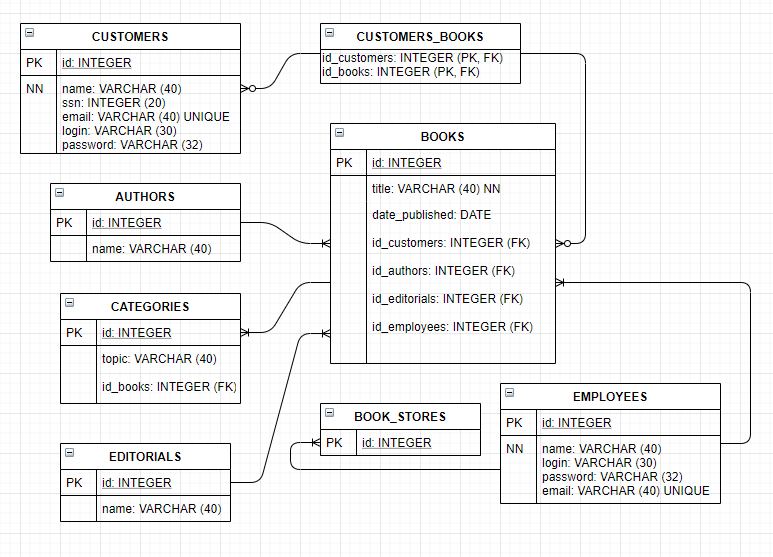

# Book Store Entity-Relation Diagram
This is the first ER diagram that I've done.
It is my idea of an Entity Relation Diagram of a Book Store.
This was done learning about the Fundamentals of Data Bases (Fundamentos de Bases de Datos) course from Platzi.

## First Iteration

I realized there was a need to create a break between Employees and Book Stores and to adjust some VARCHAR lengths

