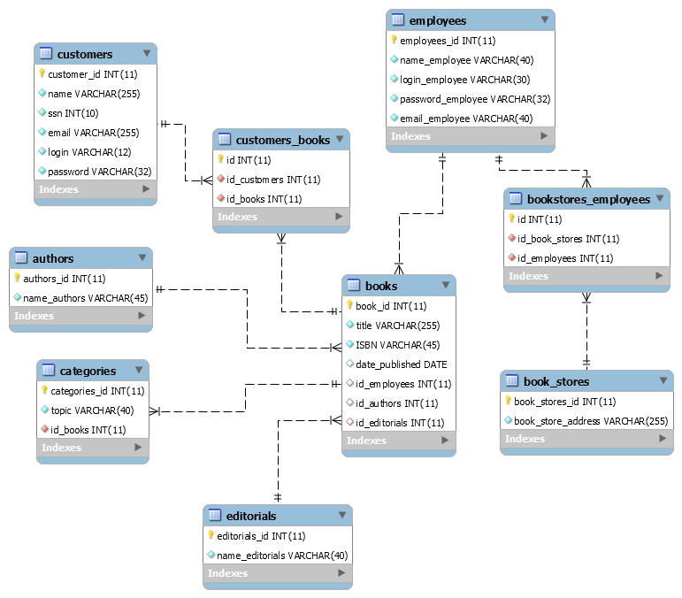
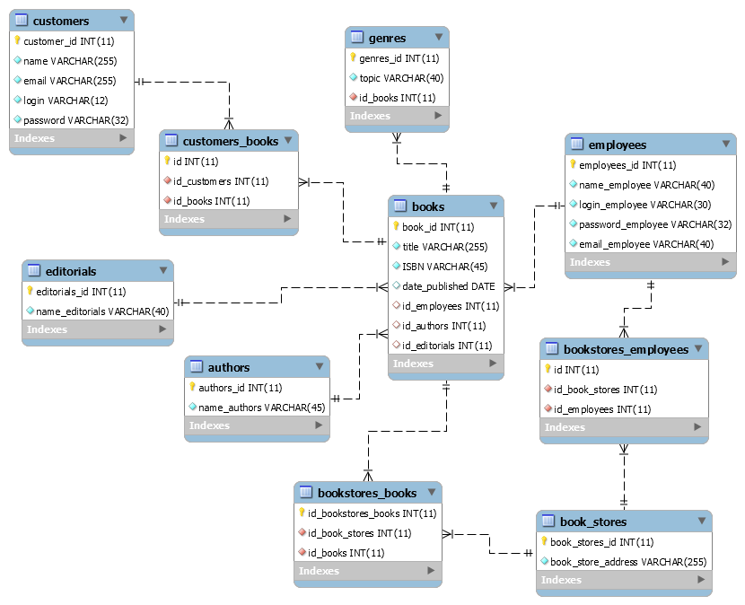
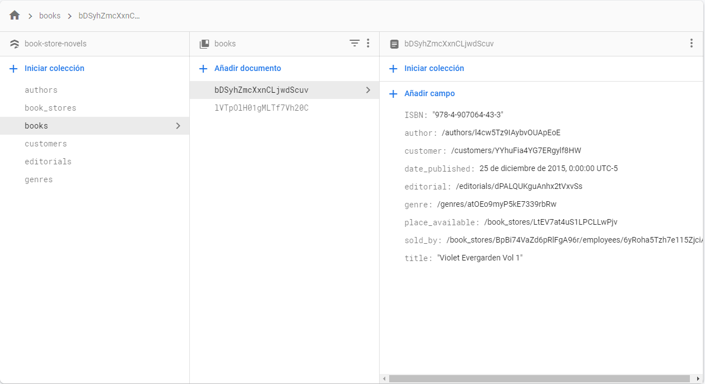

# Book Store Entity-Relation Diagram
This is the first ER diagram that I've done.
It is my idea of an Entity Relation Diagram of a Book Store.   
This was done learning about the Fundamentals of Data Bases (Fundamentos de Bases de Datos) course from Platzi.

## First Iteration

I realized there was a need to create a break between Employees and Book Stores and to adjust some VARCHAR lengths

## Second Iteration

Since one book can have availability in many stores and a book store is made of many books, I added a many-to-many cardinality.  
There was no need to have the SSN number from a customer, so I erased it.  
I consider is accurate to say Genre instead of Category. Table named "Categories" was changed to "Genres"

# Firebase

Tried to re-create the DB in this NoSQL based on Documents.    
Top Level Collections:  
 - Customers  
 - Books  
 - Authors  
 - Genres  
 - Editorials  
 - Book Stores    

Sub-collections:  
- Employees (Sub-collection from Book Stores)

